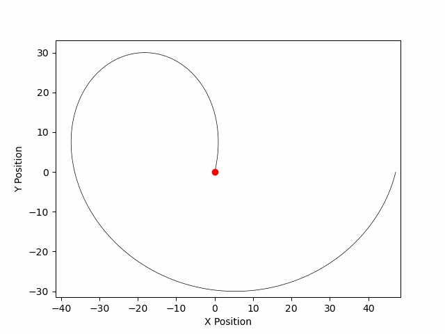

# RL_CMAES
**Authors: John DiNovi & Adam Boesky**



Using the covariance matrix adaptation evolution strategy (CMA-ES) to conduct policy optimization in a reinforcement learning (RL) framework.

## Setup Instructions
* Add ```export RL_CMAES_ROOT='/path/to/root/directory';``` to the ```~/.zshrc``` file
